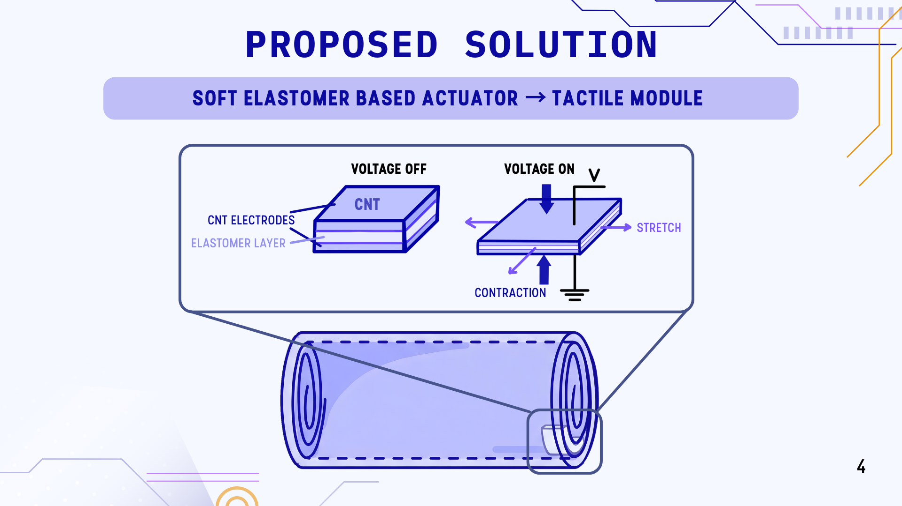
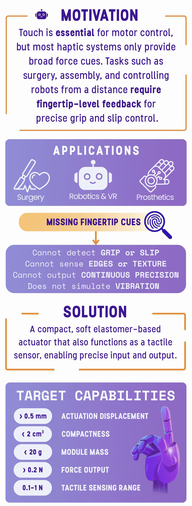
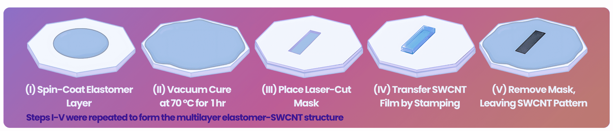

# Dielectric Elastomer Actuator Haptic Feedback Glove

Compact dielectric elastomer actuators for haptic feedback in a wearable glove.

[Click here for the full poster image](images/FYDPPoster.png)

This repository documents the design and prototyping of compact dielectric elastomer actuators (DEAs) for use in a wearable haptic feedback glove. The system is intended for robotic teleoperation and imitation learning, providing localized tactile feedback through lightweight, compliant actuators.

The work covers actuator design, multilayer fabrication, modelling, and prototype development.

The diagram shows the DEA working principle. It's made out of alternating elastomer layers and CNT electrodes. When voltage is applied, the structure compresses through its thickness and expands laterally, producing actuation in the rolled device.

## Overview

Most haptic systems provide broad force cues, but not the localized fingertip feedback needed for precise grip control, slip detection, and object interaction. This project explores a soft elastomer-based actuator that can be integrated into a glove to deliver compact, fingertip-level tactile output.

## Device Concept

The actuator is built from alternating elastomer dielectric layers and compliant CNT electrodes. When high voltage is applied across the structure, electrostatic compression causes deformation that is redirected into useful mechanical output. The multilayer structure is then rolled into a compact cylindrical actuator for glove integration.

## Device Simulation

The device is simulated via COMSOL Multiphysics to analyze the behavior.

## Fabrication Workflow

The device is fabricated by spin-coating elastomer layers, curing them, patterning the active region with a mask, transferring SWCNT films, and assembling the multilayer structure into a rolled actuator.

## Repository Contents

- `COMSOL/` - simulation files and modelling work
- `docs/` - project documents and supporting material
- `images/` - figures used in the documentation
- `CapacitanceChange.mov` - prototype response video

## Current Prototype

The current prototype demonstrates the core rolled DEA geometry and supports ongoing testing of capacitance change, displacement behaviour, and electrical actuation performance.

## Applications

Potential applications include:
- robotic teleoperation
- VR haptics
- prosthetics
- tactile sensing research
- human-robot interaction

## Team

University of Waterloo, Nanotechnology Engineering  
Andy Yan (a24yan@uwaterloo.ca), Daniel Chen (d338chen@uwaterloo.ca) Gigi Sae-zheng (gsaezhen@uwaterloo.ca), Aladara State-Ezust (astateezust@uwaterloo.ca)

## Notes

This repository is intended as a technical overview of the project, including concept development, fabrication process, and prototype progress.